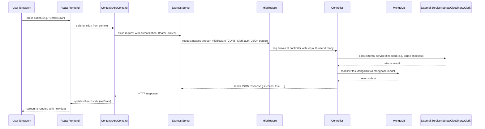
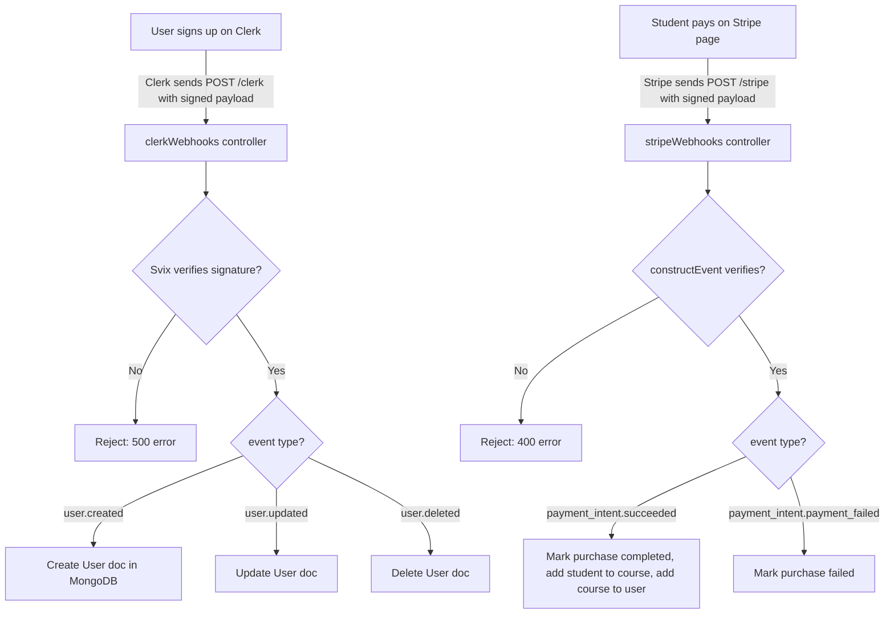
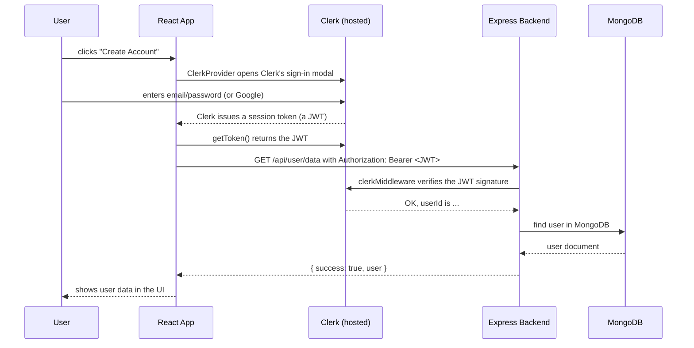

# Edemy — Complete Technical Handbook & Interview Preparation Guide

> **Read me first:** This document is the single source of truth for understanding the **Edemy** project. It explains the project from scratch — what it is, how it works, every important file, every decision, and how to talk about it in an interview. It is written in simple English. Every technical word is explained the first time it appears.

**Important honesty note:** This documentation is based **only on the actual source code** in this repository. Where the project does something well, we say so. Where it has bugs, weaknesses, or missing features, we say that too. A good engineer knows their own project's problems — interviewers love honesty and self-awareness. Real bugs that exist in the code are clearly marked with ⚠️ symbols so you can talk about them confidently instead of being caught off guard.

---

# 1. Project Overview

## 1.1 What problem does this project solve?

**Edemy** is an **online learning platform** (also called a *Learning Management System*, or LMS). It is a website that connects two kinds of people:

1. **Educators** — people who know a subject (like JavaScript or Python) and want to **sell their knowledge** as video courses.
2. **Students** — people who want to **learn** these subjects by buying and watching video courses.

The problem it solves: in the real world, if an educator wants to sell courses online, they need many separate tools:

- A website to list courses (frontend)
- A server to handle logins and data (backend)
- A database to store users and courses (database)
- A payment system to take money (Stripe)
- A place to store video files and images (Cloudinary)
- A login/registration system with password security (Clerk)

Edemy combines **all of these into one application** so that an educator can sign up, publish a course, collect payments, and see analytics — and a student can browse, buy, and learn — without either side needing any technical knowledge.

## 1.2 Why was this project built?

The project was built to demonstrate a complete, real-world, full-stack web application. It was built as a learning project that shows how all the pieces of a modern web app fit together:

- A modern React frontend
- A Node.js/Express backend
- A MongoDB database
- Third-party services (Clerk for auth, Stripe for payments, Cloudinary for media)
- Deployment configuration

It is a portfolio-worthy project because it touches nearly every area a professional web developer works with.

## 1.3 Who will use it?

| User type | What they do |
|---|---|
| **Students** (logged-out visitors too) | Browse courses, search, watch free preview lectures, buy courses with a credit card, watch lectures, track progress, rate courses |
| **Educators** | Sign up, become an educator, create courses (title, rich-text description, chapters, lectures, price, discount, thumbnail), see earnings and enrolled students |
| **Admins / Platform owner** | (Not yet implemented — see Section 22) Would manage users, courses, and payouts |

## 1.4 Real-world use cases

- A freelance instructor teaches a course and sells it directly to students without paying a marketplace commission.
- A college student buys a course on web development, watches it, and tracks how much they completed.
- A company instructor uploads internal training videos and sees which employees enrolled.
- A content creator uses free preview lectures to market a paid course.

## 1.5 Existing problems in the industry

Big marketplaces like **Udemy, Coursera, and Skillshare** dominate online learning. They have real problems:

- **High commissions** — they take a big cut of every sale (sometimes 37–50%+).
- **No ownership** — the instructor's audience belongs to the platform, not to them.
- **Slow onboarding** — strict approval processes; you cannot just publish a course instantly.
- **Generic experience** — every instructor gets the same template; hard to brand yourself.
- **Weak progress tools** — students get lost; there is little personalization.
- **Complex pricing and tax logic** hidden from the seller.

## 1.6 How our project improves upon them

- **Instant publishing** — an educator becomes one and can publish immediately (no approval queue).
- **Ownership and direct control** — educators see exactly who bought their courses and how much they earned.
- **Direct payments** — Stripe charges the card and the platform holds the money; simple and transparent.
- **Simple, dual-role experience** — one app serves both students and educators with clean dashboards.
- **Preview-free lectures** — educators can show the first lecture free to attract buyers while protecting the paid content.
- **Progress tracking and ratings** — students see completion bars; courses get star ratings.
- **Simple architecture** — easy for a beginner to understand and extend.

## 1.7 Why is this project useful?

- **For a learner:** it is a clean, working example of a real product, not a toy.
- **For a recruiter/interviewer:** it demonstrates knowledge of React, Node, databases, authentication, payments, file uploads, webhooks, security concepts, and deployment.
- **For the author:** it proves the ability to integrate many third-party services correctly and ship something end-to-end.

---

# 2. High Level Architecture

## 2.1 What kind of architecture is this?

Edemy is a **client-server architecture** with a **single-page application (SPA)** frontend and a **monolithic REST API** backend.

- **Client** = the browser running a React app. It talks to the backend using **HTTP** requests (with the `axios` library).
- **Server** = a Node.js + Express application. It exposes a **REST API** (URLs like `/api/course/all`). It connects to MongoDB, Clerk, Cloudinary, and Stripe.
- **Database** = MongoDB Atlas (a cloud-hosted MongoDB database).
- **External services** = Clerk (authentication), Cloudinary (image storage), Stripe (payments), Svix (webhook verification).

The client and server are **deployed separately** on Vercel (see Section 16), and they communicate over the internet using the backend URL stored in an environment variable.

## 2.2 Architecture diagram (overview)

```mermaid
flowchart LR
    subgraph Browser
        U[User]
        REACT[React App\n(Vite + Tailwind)]
    end

    U <--> REACT

    REACT <-->|"axios HTTP requests + JWT Bearer token"| API

    subgraph Backend
        API[Express Server\nserver.js]
        MW[Middleware:\nCORS, Clerk, JSON body parser]
        ROUTES[Routes]
        CTRL[Controllers]
        MODELS[Mongoose Models]
        API --> MW
        MW --> ROUTES
        ROUTES --> CTRL
        CTRL --> MODELS
    end

    MODELS <--> DB[(MongoDB Atlas)]

    CTRL <--> CLERK_AUTH[Clerk Auth Service]
    CTRL <--> CLOUD[(Cloudinary Media)]
    CTRL <--> STRIPE[Stripe Payments]

    STRIPE -. "webhook: /stripe" .-> API
    CLERK_AUTH -. "webhook: /clerk" .-> API

    REACT <--> CLERK_AUTH
```

## 2.3 Request flow — how data moves from a user action to a response



### Step-by-step walkthrough of one real request: **"Fetch all courses"**

1. The React app starts. `AppContextProvider` runs `fetchAllCourses()` in a `useEffect`.
2. `fetchAllCourses` uses `axios.get(backendUrl + '/api/course/all')`. No token is needed (this is a public endpoint).
3. The browser sends an HTTP `GET` request to the Express server.
4. On the server, the request first hits `cors()` middleware (allows the browser origin), then `clerkMiddleware()` (adds `req.auth`), then `express.json()` (parses the request body — not needed for GET but harmless).
5. The `courseRouter` matches `/all` and calls `getAllCourse` in `courseController.js`.
6. The controller runs `Course.find({ isPublished: true })`, selecting only the light fields (removing the heavy `courseContent` and `enrolledStudents`), and `populate`s the educator.
7. MongoDB (via Mongoose) returns the course documents.
8. The controller sends back `{ success: true, courses: [...] }` as JSON.
9. The frontend receives the response and calls `setAllCourses(data.courses)`.
10. React re-renders, and the home page shows the course cards.

## 2.4 The webhook flow (asynchronous — this is important!)

Some events do **not** come from the user's browser. They come from **other companies' servers** (Clerk and Stripe). These servers call our backend directly using **webhooks** — special URLs the backend exposes just for them.



Why webhooks? Because **the user's browser should not be trusted to confirm payment**. A student could open the browser console and lie about paying. So the flow is:

1. Browser asks our backend to create a Stripe **checkout session** (the payment page).
2. Stripe shows its own secure page; the user enters card details **on Stripe's domain**.
3. After payment, Stripe calls our backend's `/stripe` webhook with proof.
4. Only when the webhook confirms the payment does the backend add the course to the student's account.
5. Meanwhile, the browser is sent to `/loading/my-enrollments`, waits 5 seconds, then goes to "My Enrollments" — by which time the webhook has usually finished.

This design means the browser's "success redirect" is only for user experience; **the webhook is the source of truth** for money.

## 2.5 Authentication flow (simplified)

Clerk is a hosted authentication service. It manages the entire "who are you?" problem:



Clerk also **creates and updates the MongoDB user automatically** by sending a webhook to `/clerk` whenever a user is created, updated, or deleted (see Section 2.4).

## 2.6 What is NOT in this architecture (honesty section)

- **No separate services/repository layer** on the backend — controllers talk directly to Mongoose models. (This is a simplification; see Section 19.)
- **No caching layer** (no Redis, no in-memory cache).
- **No message queue** (webhooks are processed inline).
- **No AI features** (see Section 11 — AI is discussed as a future addition only).
- **No automated tests** and **no CI/CD pipeline**.
- **No Docker** setup (though the project *could* be containerized).
- **No SQL database** — this project deliberately uses MongoDB.

Knowing what is *not* there is as important as knowing what is there.

---

# 3. Complete Folder Structure

## 3.1 The full folder tree

This is the complete tree of the repository (excluding `node_modules` and image/asset binary files, which are not code).

```
Edemy/
├── .gitignore                  # Tells git which files NOT to track
├── README.md                   # Marketing-style readme for GitHub
├── PROJECT_DOCUMENTATION.md    # This file
├── client/                     # ── FRONTEND (React + Vite) ──────────────
│   ├── .gitignore
│   ├── index.html              # The single HTML page that loads the app
│   ├── package.json            # Frontend dependencies + scripts
│   ├── package-lock.json       # Exact versions of every dependency
│   ├── vite.config.js          # Vite (build tool) configuration
│   ├── tailwind.config.js      # Tailwind CSS configuration
│   ├── postcss.config.js       # PostCSS (CSS processing) configuration
│   ├── eslint.config.js        # ESLint (code quality) configuration
│   ├── vercel.json             # Vercel rewrite rules (SPA routing)
│   ├── public/                 # Static files copied as-is to the server
│   └── src/
│       ├── main.jsx            # Application entry point (React root)
│       ├── App.jsx             # Router + global layout
│       ├── index.css           # Global CSS + Tailwind + font import
│       ├── assets/
│       │   ├── assets.js       # Imports and exports all images/icons
│       │   ├── rich-text-css.txt  # CSS for rendered rich text
│       │   └── *.svg, *.png    # Images and icons (50+ files)
│       ├── context/
│       │   └── AppContext.jsx  # Global state + API calls shared by all pages
│       ├── components/
│       │   ├── student/        # Reusable UI pieces for the student side
│       │   │   ├── Navbar.jsx
│       │   │   ├── Hero.jsx
│       │   │   ├── SearchBar.jsx
│       │   │   ├── CourseCard.jsx
│       │   │   ├── CoursesSection.jsx
│       │   │   ├── Companies.jsx
│       │   │   ├── TestimonialsSection.jsx
│       │   │   ├── CallToAction.jsx
│       │   │   ├── Loading.jsx
│       │   │   ├── Rating.jsx
│       │   │   └── Footer.jsx
│       │   └── educator/       # Reusable UI pieces for the educator side
│       │       ├── Navbar.jsx
│       │       ├── Sidebar.jsx
│       │       └── Footer.jsx
│       └── pages/
│           ├── student/        # Full pages (screens) for students
│           │   ├── Home.jsx
│           │   ├── CoursesList.jsx
│           │   ├── CourseDetails.jsx
│           │   ├── MyEnrollments.jsx
│           │   └── Player.jsx
│           └── educator/       # Full pages (screens) for educators
│               ├── Educator.jsx        # Layout wrapper (navbar + sidebar + outlet)
│               ├── Dashboard.jsx
│               ├── AddCourse.jsx
│               ├── MyCourses.jsx
│               └── StudentsEnrolled.jsx
└── server/                     # ── BACKEND (Node + Express) ─────────────
    ├── .env                    # ⚠️ SECRET environment variables (committed to git!)
    ├── package.json            # Backend dependencies + scripts
    ├── package-lock.json       # Exact versions of every dependency
    ├── vercel.json             # Vercel serverless function config
    ├── server.js               # Entry point: creates the Express app
    ├── configs/
    │   ├── mongodb.js          # MongoDB connection logic
    │   ├── cloudinary.js       # Cloudinary configuration
    │   └── multer.js           # Multer file-upload configuration
    ├── middlewares/
    │   └── authMiddleware.js   # protectEducator (role check)
    ├── models/
    │   ├── User.js             # User schema
    │   ├── Course.js           # Course + Chapter + Lecture schemas
    │   ├── CourseProgress.js   # Per-student, per-course progress
    │   └── Purchase.js         # Payment/purchase record
    ├── controllers/
    │   ├── courseController.js     # Public course endpoints
    │   ├── educatorController.js   # Educator-only endpoints
    │   ├── userController.js       # Student/user endpoints
    │   ├── webhooks.js             # Clerk + Stripe webhooks
    │   └── healthCheckController.js # Database health endpoint
    └── routes/
        ├── courseRoute.js      # /api/course routes
        ├── educatorRoutes.js   # /api/educator routes
        ├── userRoutes.js       # /api/user routes
        └── healthCheckRoute.js # /health-check route
```

## 3.2 Why this folder structure exists — folder by folder

### `client/` — the frontend
**Why it exists:** All code that runs in the user's browser lives here. It is a separate project from the backend, with its own dependencies and its own deployment.

**What should go inside:** React components, pages, styles, assets, and configuration for the build tools.

**Why the separation matters:** The frontend and backend have completely different life cycles. The frontend is *static files* (HTML/CSS/JS that the browser downloads once). The backend is a *running program* that responds to requests. If you mixed them, you could not deploy or scale them independently. This separation is called **decoupling**.

### `client/src/` — the actual application code
**Why it exists:** `src` (short for "source") is the code you write. Everything Vite needs to build your app is here.

**What should go inside:** All `.jsx`/`.js` files, CSS, and imported assets. Files in `public/` are different — they are copied as-is and not processed.

### `client/src/pages/` — one component per screen
**Why it exists:** Each *screen* the user sees is a page component. Pages are big — they combine many smaller components.

**What should go inside:** One file per route. `Home.jsx` for `/`, `CourseDetails.jsx` for `/course/:id`, etc.

**Why it matters:** When a URL changes, React Router swaps the page component. Keeping one file per screen makes it easy to answer "where is the code for this screen?" It also supports **code splitting** (Section 15) later.

### `client/src/components/` — reusable UI pieces
**Why it exists:** Components are small, focused building blocks. Pages compose them.

**What should go inside:** Reusable pieces like `Navbar`, `Footer`, `CourseCard`, `Loading`. They are split into `student/` and `educator/` because the two roles have different interfaces (the educator's sidebar is never shown to students).

**Why it matters:** Reuse. `CourseCard` is used on the home page, the course list, and search results — written once, used everywhere. Fixing it once fixes it everywhere (DRY — Don't Repeat Yourself).

### `client/src/context/` — global state
**Why it exists:** Many pages need the same data (all courses, the logged-in user, the currency symbol). Instead of passing data through many layers (called *prop drilling*), a single React **Context** holds it.

**What should go inside:** Context providers that define global state and shared functions (here: `AppContext.jsx`).

**Why it matters:** Every page can grab what it needs in one line: `const { allCourses } = useContext(AppContext)`. It is the app's "shared memory."

### `client/src/assets/` — static images and icons
**Why it exists:** All images, SVG icons, and the shared `assets.js` file live here. Keeping them out of components keeps components clean.

**What should go inside:** Image/icon files plus `assets.js`, which imports them and exports one big object.

### `server/` — the backend API
**Why it exists:** This is the brain. It stores data, enforces rules (business logic), talks to external services, and answers HTTP requests from the frontend.

**What should go inside:** Express application code, organized by responsibility.

### `server/configs/` — setup code that runs once
**Why it exists:** Connecting to MongoDB, configuring Cloudinary, and setting up Multer are "plumbing" tasks — they don't change per request. Config files keep `server.js` short.

**What should go inside:** Anything that needs configuration/connection at startup.

### `server/middlewares/` — code that runs before controllers
**Why it exists:** Middleware is a function that runs *between* the request arriving and the controller handling it. The `protectEducator` middleware checks "is this user an educator?" before allowing access to educator routes.

**What should go inside:** Reusable request pre-processing.

### `server/models/` — the shape of data (schemas)
**Why it exists:** Mongoose uses schemas to define what a document looks like and what rules it must follow (required fields, types, enums).

**What should go inside:** One file per MongoDB collection: `User`, `Course`, `CourseProgress`, `Purchase`.

### `server/controllers/` — the "what happens when" logic
**Why it exists:** When a request arrives, a controller function does the actual work: reads the request, talks to the database, and sends the response.

**What should go inside:** One file per resource, each exporting several handler functions.

### `server/routes/` — the URL map
**Why it exists:** Routes connect URLs to controller functions. They are the app's address book.

**What should go inside:** One router file per resource group (course, educator, user, health check).

**Why the separation matters:** Each folder answers one question:
- **routes** → "which URL goes to which function?"
- **controllers** → "what should happen for this URL?"
- **models** → "what does the data look like?"
- **configs** → "how do we connect to things?"
- **middlewares** → "what must be checked before the controller runs?"

This is called **separation of concerns** — each piece has exactly one job, which makes the code easy to read, test, and change.

---

# 4. File-by-File Explanation

## Backend Files

---

### `server/server.js` — The Main Backend File

**Why it exists:** This is the starting point of the entire backend. When you run `node server.js`, this file runs first. It sets up everything: the web server, database connection, and all the routes (URLs).

**When it runs:** Once, when the backend server starts.

**What it does, step by step:**

```javascript
import express from 'express'         // Import Express (web framework)
import cors from 'cors'               // Import CORS (security for cross-origin requests)
import 'dotenv/config'               // Load .env file (secrets)
import connectDB from './configs/mongodb.js'  // Import DB connector
// ...all routes and controllers imported

const app = express()        // Create the Express app (like creating a server)
await connectDB()            // Connect to MongoDB before accepting requests
app.use(cors())              // Allow frontend (on different port) to call this API
app.use(clerkMiddleware())   // Attach Clerk auth to every request

// Register all routes
app.use('/api/educator', express.json(), educatorRouter)
app.use('/api/course', express.json(), courseRouter)
app.use('/api/user', express.json(), userRouter)
app.post('/clerk', express.json(), clerkWebhooks)       // Clerk user events
app.post('/stripe', express.raw(...), stripeWebhooks)  // Stripe payment events

app.listen(5000)  // Start listening for incoming requests
```

> **Important Detail:** The `/stripe` route uses `express.raw()` instead of `express.json()`. This is because Stripe sends a raw request body (not JSON) so it can verify the signature. If you use `express.json()` here, the signature check will fail and payments will break.

**Files it depends on:** All routes, controllers, configs.

---

### `server/configs/mongodb.js` — Database Connection

**Why it exists:** Connects the backend to the MongoDB database. Without this, no data can be saved or retrieved.

**Key function: `connectDB()`**

```javascript
const connectDB = async () => {
    mongoose.connection.on('connected', () => console.log('Database Connected'))
    await mongoose.connect(`${process.env.MONGODB_URI}/lms-copy`)
}
```

- **Input:** None. It reads the MongoDB URI from environment variables.
- **Output:** A live connection to MongoDB.
- **Step-by-step:** Registers a listener that prints "Database Connected" when the connection opens, then calls `mongoose.connect()` to establish the connection.

The database name is `lms-copy` (set in the URI).

> **Why `await`?** Connecting to a database takes time (it goes over the internet). Using `await` makes the server wait until the connection is established before accepting any requests. This prevents the situation where a request comes in and the database isn't ready yet.

---

### `server/configs/cloudinary.js` — Image Storage Configuration

**Why it exists:** Cloudinary is a cloud service for storing images and videos. This file configures the Cloudinary SDK with our credentials so we can upload images later.

```javascript
cloudinary.config({
    cloud_name: process.env.CLOUDINARY_NAME,
    api_key: process.env.CLOUDINARY_API_KEY,
    api_secret: process.env.CLOUDINARY_SECRET_KEY
})
export default cloudinary
```

When `educatorController.js` imports `cloudinary`, it already has the credentials pre-loaded. It can then call `cloudinary.uploader.upload(filePath)` to upload an image.

---

### `server/configs/multer.js` — File Upload Handler

**Why it exists:** When an educator uploads a course thumbnail image, the image arrives as raw binary data in the HTTP request. Multer is middleware that parses this binary data and makes the file accessible via `req.file`.

```javascript
const storage = multer.diskStorage({})  // Empty = use temp disk storage
const upload = multer({ storage })
export default upload
```

`multer.diskStorage({})` with an empty config means files are saved to a temporary directory on the server's disk. The path of that temp file is then passed to Cloudinary for permanent upload. This is important because Cloudinary's `uploader.upload()` accepts a file path.

**How it's used:** In `educatorRoutes.js`:
```javascript
educatorRouter.post('/add-course', upload.single('image'), protectEducator, addCourse)
```
`upload.single('image')` tells Multer to look for a file in the field named `image` and put it in `req.file`.

---

### `server/models/User.js` — User Schema

**Why it exists:** Defines the structure (schema) for a User document in MongoDB.

```javascript
const userSchema = new mongoose.Schema({
    _id: { type: String, required: true },     // Clerk's user ID (not MongoDB's auto-ID)
    name: { type: String, required: true },
    email: { type: String, required: true },
    imageUrl: { type: String, required: true },
    enrolledCourses: [{                         // Array of course IDs this user has purchased
        type: mongoose.Schema.Types.ObjectId,
        ref: 'Course'
    }],
}, { timestamps: true })
```

> **Key Design Decision — `_id: String`:** Normally MongoDB auto-generates an `_id` (like `507f1f77bcf86cd799439011`). But here, `_id` is a **String** because we use **Clerk's user ID** (like `user_2xyz...`) as the primary key. This makes it easy to look up a user directly with `User.findById(req.auth.userId)` without any mapping.

**`enrolledCourses`** uses `ref: 'Course'` which enables Mongoose's `.populate()` method — it can automatically replace the course ID with the full course object when you query.

---

### `server/models/Course.js` — Course Schema (Nested Documents)

This is the most complex schema in the project. A course has **chapters**, and each chapter has **lectures**. This is modeled as **nested subdocuments**.

```javascript
const lectureSchema = new mongoose.Schema({
    lectureId: String,       // Unique ID for tracking progress
    lectureTitle: String,
    lectureDuration: Number, // In minutes
    lectureUrl: String,      // YouTube URL
    isPreviewFree: Boolean,  // Can non-enrolled users watch this?
    lectureOrder: Number     // Order within the chapter
}, { _id: false })           // No separate _id for lectures

const chapterSchema = new mongoose.Schema({
    chapterId: String,
    chapterOrder: Number,
    chapterTitle: String,
    chapterContent: [lectureSchema]  // Array of lectures
}, { _id: false })

const courseSchema = new mongoose.Schema({
    courseTitle: String,
    courseDescription: String,       // HTML content from Quill editor
    courseThumbnail: String,         // Cloudinary URL
    coursePrice: Number,
    isPublished: { type: Boolean, default: true },
    discount: { type: Number, min: 0, max: 100 },
    courseContent: [chapterSchema],  // Array of chapters
    educator: { type: String, ref: 'User' }, // Who created this
    courseRatings: [{ userId: String, rating: Number }],
    enrolledStudents: [{ type: String, ref: 'User' }]
}, { timestamps: true, minimize: false })
```

> **`minimize: false`** — MongoDB by default removes empty objects `{}` from the document when saving. Setting `minimize: false` prevents this. This is important because `courseContent` or `enrolledStudents` might be empty arrays when a course is first created, and we don't want them to disappear.

> **`_id: false` on subdocuments** — Chapters and lectures don't need their own MongoDB IDs since they use `chapterId` and `lectureId` (generated by `uniqid` on the frontend). Adding `{ _id: false }` keeps the document cleaner.

---

### `server/models/Purchase.js` — Purchase Schema

```javascript
const PurchaseSchema = new mongoose.Schema({
    courseId: { type: ObjectId, ref: 'Course' },
    userId: { type: String, ref: 'User' },
    amount: Number,
    status: { type: String, enum: ['pending', 'completed', 'failed'], default: 'pending' }
}, { timestamps: true })
```

**The purchase lifecycle:**
1. User clicks "Enroll Now" → Purchase created with `status: 'pending'`
2. User pays on Stripe → Stripe webhook fires → `status: 'completed'`
3. Payment fails → `status: 'failed'`

This allows you to track payments that were started but never completed (e.g., user closed the browser on Stripe's page).

---

### `server/models/CourseProgress.js` — Progress Tracking

```javascript
const courseProgressSchema = new mongoose.Schema({
    userId: String,
    courseId: String,
    completed: { type: Boolean, default: false },
    lectureCompleted: []   // Array of lectureIds that the user has completed
}, { minimize: false })
```

Simple but effective. Instead of tracking each lecture as a separate row, we store all completed lecture IDs in one array per user per course. To check if a lecture is done: `lectureCompleted.includes(lectureId)`.

---

### `server/controllers/userController.js` — User Business Logic

Contains 5 functions:

#### `getUserData(req, res)`
- **Purpose:** Fetch the logged-in user's data from the database.
- **Input:** `req.auth.userId` (set by Clerk middleware from the JWT)
- **Output:** The user document from MongoDB
- **Steps:** Find user by ID, return it. Return error if not found.

#### `userEnrolledCourses(req, res)`
- **Purpose:** Get all courses the user has purchased (with full course data).
- **Key detail:** Uses `.populate('enrolledCourses')` — this replaces the array of course IDs with actual course objects. The frontend gets full course data in one API call.

#### `purchaseCourse(req, res)`
- **Purpose:** Initiate the checkout process when a student clicks "Enroll Now".
- **Steps:**
  1. Validate user and course exist
  2. Calculate the discounted price: `price - (discount% * price / 100)`
  3. Create a Purchase record in MongoDB with `status: 'pending'`
  4. Create a Stripe Checkout Session with the course title and price
  5. Embed the `purchaseId` in Stripe's metadata so we can find it later in the webhook
  6. Return the Stripe session URL to the frontend
  7. Frontend redirects the user to Stripe's hosted payment page

#### `updateUserCourseProgress(req, res)`
- **Purpose:** Mark a lecture as completed.
- **Steps:**
  1. Look for existing progress record for this user + course
  2. If found: check if lecture already completed (prevent duplicate). If not, push the `lectureId` into `lectureCompleted[]`.
  3. If not found: create a new progress record.

#### `addUserRating(req, res)`
- **Purpose:** Let an enrolled student rate a course (1–5 stars).
- **Validation:**
  - Rating must be between 1 and 5
  - User must be enrolled in the course (`user.enrolledCourses.includes(courseId)`)
  - If user already rated: update the existing rating. If not: push a new rating.

---

### `server/controllers/educatorController.js` — Educator Business Logic

#### `updateRoleToEducator(req, res)`
- **Purpose:** Upgrade a user's role from student to educator.
- **How:** Calls `clerkClient.users.updateUserMetadata(userId, { publicMetadata: { role: 'educator' } })`
- **Effect:** Clerk's JWT will now include `role: 'educator'` in `publicMetadata`. The frontend reads this to show/hide educator features.

#### `addCourse(req, res)`
- **Purpose:** Create a new course in the database and upload the thumbnail to Cloudinary.
- **Steps:**
  1. Check that an image file was attached (`req.file`)
  2. Parse the `courseData` JSON string from `req.body` (it was sent as a string because it came with a file in FormData)
  3. Set `educator = req.auth.userId`
  4. Create the course in MongoDB (thumbnail URL is empty at this point)
  5. Upload the image file from the temp path to Cloudinary
  6. Get the secure URL back from Cloudinary (`imageUpload.secure_url`)
  7. Update the course's `courseThumbnail` field with the Cloudinary URL
  8. Save and respond

#### `educatorDashboardData(req, res)`
- **Purpose:** Provide analytics for the educator's dashboard.
- **Returns:** Total earnings, total courses, list of enrolled students with course titles.
- **Logic:**
  1. Find all courses created by this educator
  2. Find all **completed** purchases for those courses
  3. Sum up `purchase.amount` for total earnings
  4. For each course, find all enrolled students by their IDs
  5. Return a flat array `[{ courseTitle, student }]`

#### `getEnrolledStudentsData(req, res)`
- **Purpose:** More detailed student list with purchase dates.
- **Uses `.populate()`** to get student names/images and course titles in one query.

---

### `server/controllers/courseController.js` — Public Course Data

#### `getAllCourse(req, res)`
- **Purpose:** Return all **published** courses for the browse page.
- **Security:** Excludes `courseContent` and `enrolledStudents` fields — there's no need to send all lecture URLs to someone who hasn't bought the course yet.
- **Used on:** Home page, Courses List page.

#### `getCourseId(req, res)`
- **Purpose:** Return full data for one specific course.
- **Security feature:** Iterates through all lectures and if `isPreviewFree === false`, it sets `lectureUrl = ""` (empty string). This means non-enrolled users see the lecture titles and durations but cannot get the video URL to watch.

---

### `server/controllers/webhooks.js` — Event Receivers

This file handles **webhooks** — automated messages sent by external services when something happens.

#### `clerkWebhooks(req, res)`
- **Why it exists:** When a user signs up or updates their profile in Clerk, our MongoDB database needs to know about it too. Clerk sends a webhook event to our backend.
- **Security:** Uses `svix` library to verify the webhook signature. This ensures the request is actually from Clerk and not from a hacker trying to fake a user creation.
- **Handles 3 events:**
  - `user.created` → Creates a new User document in MongoDB
  - `user.updated` → Updates name, email, imageUrl in MongoDB
  - `user.deleted` → Deletes the User from MongoDB

#### `stripeWebhooks(request, response)`
- **Why it exists:** After a user pays on Stripe's checkout page, our backend needs to know the payment succeeded so we can give the user access to the course.
- **Security:** Uses `stripeInstance.webhooks.constructEvent()` to verify the signature. If the secret doesn't match, the request is rejected.
- **Handles `payment_intent.succeeded`:**
  1. Find the Stripe Checkout Session using the payment intent ID
  2. Get the `purchaseId` from session metadata (we saved it there when creating the session)
  3. Find the Purchase, User, and Course from the database
  4. Add user to `course.enrolledStudents[]`
  5. Add course to `user.enrolledCourses[]`
  6. Update Purchase status to `'completed'`
- **Handles `payment_intent.payment_failed`:** Sets Purchase status to `'failed'`

---

### `server/middlewares/authMiddleware.js` — Educator Route Guard

```javascript
export const protectEducator = async (req, res, next) => {
    const userId = req.auth.userId
    const response = await clerkClient.users.getUser(userId)
    if (response.publicMetadata.role !== 'educator') {
        return res.json({ success: false, message: 'Unauthorized Access' })
    }
    next()
}
```

This is a **middleware** function — it runs between the HTTP request arriving and the controller function executing.

- **Input:** The request (with `req.auth.userId` set by Clerk's middleware)
- **What it does:** Fetches the user's metadata from Clerk and checks if their role is `'educator'`
- **If not educator:** Returns an error response immediately. The controller never runs.
- **If educator:** Calls `next()` which passes control to the next function in the chain (the actual controller)

---

## Frontend Files

---

### `client/src/main.jsx` — The React Entry Point

This is the very first file React loads. It wraps the entire application in three **Provider** components:

```jsx
<BrowserRouter>           // Enables client-side routing
  <ClerkProvider>         // Makes Clerk auth available everywhere
    <AppContextProvider>  // Makes our global state available everywhere
      <App />             // The actual app
    </AppContextProvider>
  </ClerkProvider>
</BrowserRouter>
```

Think of providers as **layers of context**. The innermost component (`App`) can access everything the outer layers provide.

**`PUBLISHABLE_KEY` check:** If the Clerk Publishable Key is missing from `.env`, the app throws an error immediately with a clear message. This is a good practice — fail fast and loudly rather than failing silently later.

---

### `client/src/App.jsx` — Routing Configuration

Defines which URL shows which page:

```jsx
const isEducatorRoute = useMatch('/educator/*')

return (
  <div>
    <ToastContainer />
    {!isEducatorRoute && <Navbar />}  // Student navbar hidden on educator pages
    <Routes>
      <Route path="/" element={<Home />} />
      <Route path="/course-list" element={<CoursesList />} />
      <Route path="/course-list/:input" element={<CoursesList />} />
      <Route path="/course/:id" element={<CourseDetails />} />
      <Route path="/my-enrollments" element={<MyEnrollments />} />
      <Route path="/player/:courseId" element={<Player />} />
      <Route path="/loading/:path" element={<Loading />} />
      <Route path="/educator" element={<Educator />}>   // Layout route
        <Route path="/educator" element={<Dashboard />} />
        <Route path="add-course" element={<AddCourse />} />
        <Route path="my-courses" element={<MyCourses />} />
        <Route path="student-enrolled" element={<StudentsEnrolled />} />
      </Route>
    </Routes>
  </div>
)
```

**Key design:** The `/educator` route is a **layout route** — `Educator.jsx` renders a Sidebar, Navbar, and an `<Outlet />` where child pages render. This means all educator pages share the same layout without repeating code.

**`ToastContainer`** is placed at the root so toast notifications can appear on any page.

---

### `client/src/context/AppContext.jsx` — Global State Manager

This is the most important frontend file. It acts as the **central data store** for the entire app.

**What it stores:**
| State Variable | What It Is |
|---|---|
| `allCourses` | All published courses from the API |
| `enrolledCourses` | Courses the logged-in user has purchased |
| `userData` | The logged-in user's MongoDB document |
| `isEducator` | Boolean: is the current user an educator? |
| `backendUrl` | Base URL for all API calls |
| `currency` | Currency symbol (e.g., "$") |

**Functions it provides:**

#### `fetchAllCourses()`
- Calls `GET /api/course/all`
- Stores all courses in `allCourses` state
- Called once on app start (in `useEffect` with `[]` dependency)

#### `fetchUserData()`
- Checks if user has `role: 'educator'` in Clerk metadata → sets `isEducator`
- Gets the Clerk JWT token
- Calls `GET /api/user/data` with the token in the Authorization header
- Stores user data in `userData` state

#### `fetchUserEnrolledCourses()`
- Gets Clerk token
- Calls `GET /api/user/enrolled-courses`
- Reverses the array (so newest courses appear first) and stores in `enrolledCourses`

#### `calculateRating(course)`
- **Input:** A course object with `courseRatings` array
- **Output:** Average rating as a number (floor rounded)
- **Logic:** Sum all ratings, divide by count. Returns 0 if no ratings.

#### `calculateChapterTime(chapter)`
- **Input:** A chapter object with `chapterContent` array
- **Logic:** Sum all `lecture.lectureDuration` values (in minutes), convert to milliseconds, format using `humanizeDuration`
- **Output:** Human-readable string like "2 hours 30 minutes"

#### `calculateCourseDuration(course)`
- Same as above but sums across ALL chapters in a course.

#### `calculateNoOfLectures(course)`
- **Input:** Course object
- **Output:** Total count of all lectures across all chapters
- **Logic:** Sums `chapter.chapterContent.length` for each chapter

---

### `client/src/pages/student/Home.jsx`

A composition page — just renders other components in order:

```jsx
<Hero />
<Companies />
<CoursesSection />
<TestimonialsSection />
<CallToAction />
<Footer />
```

Each component is independent and self-contained.

---

### `client/src/pages/student/CoursesList.jsx`

Shows all courses in a grid with search/filter:

```jsx
const { input } = useParams()  // Search term from URL
const { allCourses } = useContext(AppContext)
const [filteredCourse, setFilteredCourse] = useState([])

useEffect(() => {
    if (input) {
        setFilteredCourse(allCourses.filter(
            item => item.courseTitle.toLowerCase().includes(input.toLowerCase())
        ))
    } else {
        setFilteredCourse(allCourses)  // Show all if no search
    }
}, [allCourses, input])
```

The search works entirely on the **client side** — no new API call is needed. Since all courses are already loaded in `allCourses`, filtering is instant. The search term is embedded in the URL (`/course-list/react`) so users can share search links.

---

### `client/src/pages/student/CourseDetails.jsx`

The course preview page with:
- Course title, description, ratings
- Expandable chapter/lecture list (accordion UI)
- Free preview player (YouTube embed, only for `isPreviewFree` lectures)
- Price display with discount calculation
- "Enroll Now" button

**Key functions:**

#### `fetchCourseData()`
- Calls `GET /api/course/:id`
- The backend strips out `lectureUrl` for non-free lectures, so even if someone inspects the network response, they cannot get video URLs for paid content

#### `toggleSection(index)`
- Opens/closes chapter accordion
- Uses state `openSections: { [index]: boolean }`
- Clicking a chapter toggles `openSections[index]` between true/false

#### `enrollCourse()`
- Checks if user is logged in (`!userData` → show warning)
- Checks if already enrolled → show warning
- Gets Clerk token
- Calls `POST /api/user/purchase`
- Redirects to Stripe URL: `window.location.replace(session_url)`

**Preview player logic:**
```javascript
lecture.lectureUrl.split('=')[1].substring(0, 11)
// "https://www.youtube.com/watch?v=dQw4w9WgXcQ" → "dQw4w9WgXcQ"
```
Extracts the 11-character YouTube video ID from the URL.

---

### `client/src/pages/student/Player.jsx`

The full video player for enrolled students:

**State:**
- `courseData` — the specific course being viewed (found from `enrolledCourses`)
- `playerData` — the currently playing lecture (set when user clicks "Watch")
- `progressData` — the user's completion data for this course
- `initialRating` — user's existing rating (if any)

**Functions:**

#### `getCourseData()`
- Searches `enrolledCourses` array for the current `courseId` (from URL params)
- Also finds the user's existing rating for pre-filling the star widget

#### `markLectureAsCompleted(lectureId)`
- Calls `POST /api/user/update-course-progress`
- On success, calls `getCourseProgress()` to refresh the tick marks

#### `getCourseProgress()`
- Calls `POST /api/user/get-course-progress`
- Gets the list of completed lecture IDs
- Used to show blue tick marks on completed lectures and "Completed" button text

#### `handleRate(rating)`
- Calls `POST /api/user/add-rating`
- On success, calls `fetchUserEnrolledCourses()` to refresh the rating data

**Player URL parsing:**
```javascript
playerData.lectureUrl.split('/').pop()
// "https://youtu.be/dQw4w9WgXcQ" → "dQw4w9WgXcQ"
```
Note: This uses `.split('/')` not `.split('=')` — the Player uses `/youtu.be/ID` format while CourseDetails uses `?v=ID` format. This is an inconsistency in the codebase — a real interview question could ask about this.

---

### `client/src/pages/student/MyEnrollments.jsx`

Displays all of the user's enrolled courses with:
- Course thumbnail and title
- Progress bar (using `rc-progress` library)
- Total duration
- Completed/total lecture count
- Button to go to Player (shows "Completed" or "On Going")

**`getCourseProgress()`:** Uses `Promise.all()` to make multiple API calls simultaneously (one for each enrolled course) instead of one by one. This is a performance optimization.

---

### `client/src/pages/educator/AddCourse.jsx`

The most complex frontend component. Allows educators to create a new course.

**State:**
- `courseTitle`, `coursePrice`, `discount` — basic fields
- `image` — the thumbnail file
- `chapters` — the entire course structure (array of chapters, each with lectures)
- `showPopup` — controls lecture-add modal visibility
- `currentChapterId` — which chapter to add the lecture to
- `lectureDetails` — temp state for the lecture being added

**Quill Editor:**
```javascript
useEffect(() => {
    if (!quillRef.current && editorRef.current) {
        quillRef.current = new Quill(editorRef.current, { theme: 'snow' })
    }
}, [])
```
Quill is a rich text editor. The `useRef` is used instead of `useState` to hold the Quill instance because changing a `ref` does not trigger a re-render. The `if (!quillRef.current)` check prevents creating multiple Quill instances on re-renders.

**`handleChapter(action, chapterId)`:**
- `'add'`: Shows browser's native `prompt()` to get chapter name, creates a new chapter object with a `uniqid()` ID
- `'remove'`: Filters out the chapter by ID
- `'toggle'`: Flips the `collapsed` boolean to show/hide lectures

**`addLecture()`:**
- Adds the lecture from `lectureDetails` state to the correct chapter
- Generates a `lectureId` with `uniqid()`
- Closes the popup and resets `lectureDetails`

**`handleSubmit(e)`:**
1. Gets the Quill HTML content via `quillRef.current.root.innerHTML`
2. Creates `courseData` object
3. Uses `FormData` to send both JSON (courseData) and file (image) in one request
4. Posts to `POST /api/educator/add-course`

---

### `client/src/pages/educator/Dashboard.jsx`

Shows educator analytics:
- Total Enrollments count
- Total Courses count
- Total Earnings (with currency symbol)
- Latest Enrollments table (student photo + name, course title)

Fetches from `GET /api/educator/dashboard` using Clerk token.
Only fetches if `isEducator` is true (from context).

---

### `client/src/pages/educator/MyCourses.jsx`

Table of all courses created by the educator with:
- Thumbnail + title
- Earnings per course (calculated on frontend: `enrolledStudents.length * discounted_price`)
- Student count
- Published date

---

### `client/src/pages/educator/StudentsEnrolled.jsx`

Table of all students enrolled in any of the educator's courses with:
- Student photo + name
- Which course they enrolled in
- Purchase date

---

### `client/src/pages/educator/Educator.jsx`

A **layout component**. It doesn't have its own content — it just arranges the educator panel layout:

```jsx
<div>
    <Navbar />
    <div className='flex'>
        <Sidebar />
        <div className='flex-1'>
            <Outlet />   // Child page renders here
        </div>
    </div>
    <Footer />
</div>
```

`<Outlet />` is from React Router. It renders whichever child route matches the current URL (Dashboard, AddCourse, MyCourses, or StudentsEnrolled).

---

### `client/src/components/student/Navbar.jsx`

The student-facing top navigation bar.

**Conditional rendering:**
- Background: `bg-cyan-100/70` normally, `bg-white` on the courses list page
- If user is logged in: shows "Become Educator" / "Educator Dashboard" button, "My Enrollments" link, and Clerk's `<UserButton />`
- If not logged in: shows "Create Account" button that opens Clerk's sign-in modal

**`becomeEducator()`:**
- If already educator: navigates to educator dashboard
- If not: calls the backend to update role, sets `isEducator` to true in context

---

### `client/src/components/student/Loading.jsx`

A dual-purpose component:
1. **Loading spinner** — Shows an animated spinning circle
2. **Redirect after delay** — If a `path` URL parameter exists, it navigates to `/${path}` after 5 seconds

Used after a Stripe payment: Stripe redirects to `/loading/my-enrollments`. The component shows a spinner for 5 seconds (giving the webhook time to process the payment) and then navigates to `/my-enrollments`.

---

### `client/src/components/student/SearchBar.jsx`

Simple search form:
- Maintains input text in local state
- On form submit: navigates to `/course-list/<search_term>`
- Accepts `data` prop to pre-fill the input (used on the CoursesList page to show the current search)

---

### `client/src/components/student/CourseCard.jsx`

A card component for displaying a single course. Shown in the grid on Home and CoursesList pages.

Displays:
- Thumbnail image
- Title
- Average star rating (calculated by `calculateRating()` from context)
- Number of ratings
- Discounted price

Wrapped in a `<Link>` component so clicking anywhere on the card navigates to `/course/:id`.

---

### `client/src/components/student/Rating.jsx`

A custom star rating widget (1–5 stars):
- `initialRating` prop: pre-fills existing rating
- `onRate` prop: callback function called when user clicks a star
- Uses `useEffect` to update local state when `initialRating` changes (important for async data loading)

> **Note:** The project also imports `react-simple-star-rating` library and uses it in Player.jsx alongside this custom component. Two rating widgets exist — this is redundant but not breaking.

---

### `client/src/components/educator/Sidebar.jsx`

Left navigation panel for the educator portal.

**Menu items:**
```javascript
const menuItems = [
    { name: 'Dashboard', path: '/educator' },
    { name: 'Add Course', path: '/educator/add-course' },
    { name: 'My Courses', path: '/educator/my-courses' },
    { name: 'Student Enrolled', path: '/educator/student-enrolled' },
]
```

Uses `NavLink` (React Router) instead of plain `Link`. NavLink automatically adds an `isActive` class when the current URL matches the link's path. This is used to highlight the active menu item with an indigo background.

`end={item.path === '/educator'}` — Without `end`, the Dashboard link would appear active on ALL educator sub-pages because `/educator` is a prefix of `/educator/add-course`. `end` makes it only match exactly `/educator`.

The entire sidebar only renders if `isEducator` is true.
